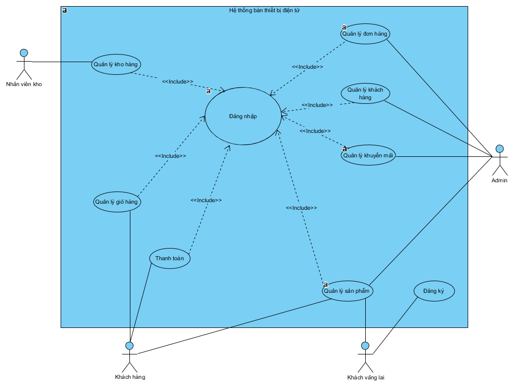
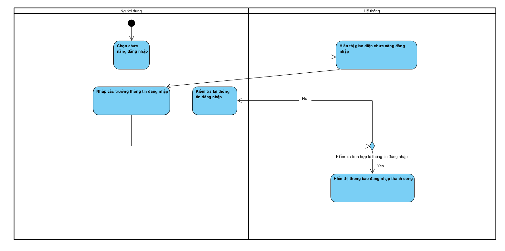
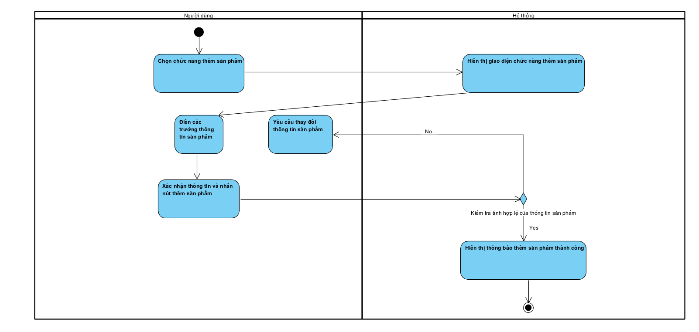
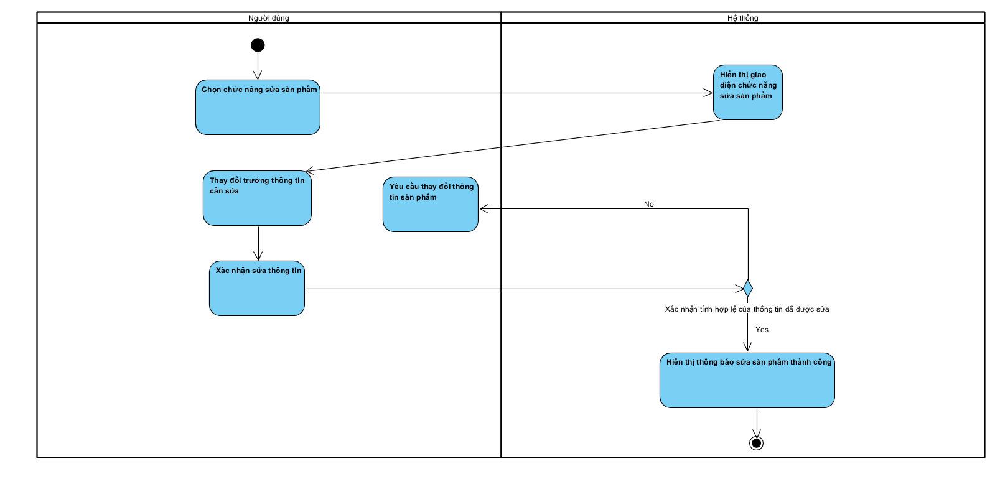
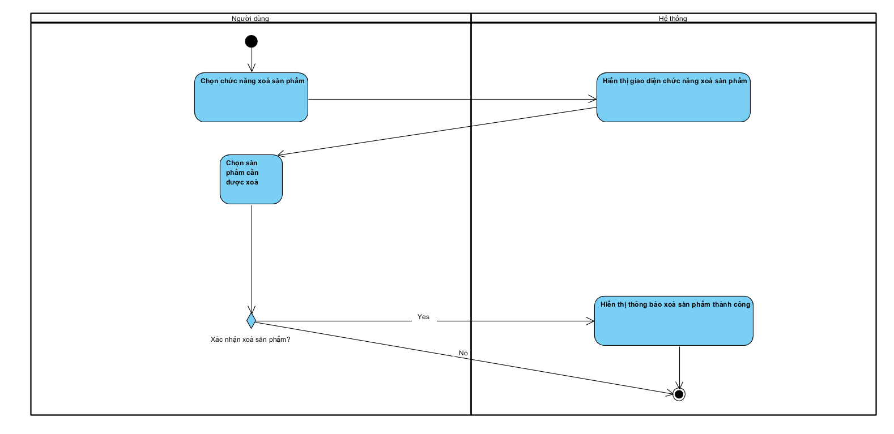
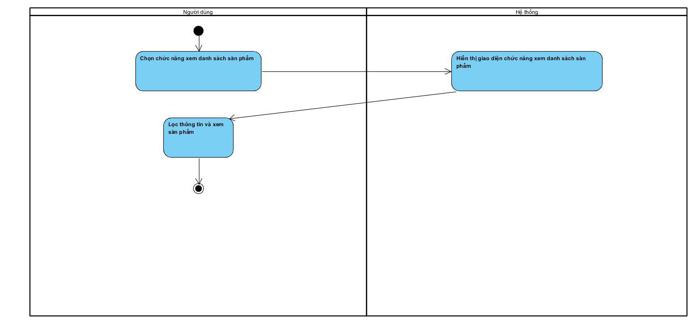

# Tài liệu phân tích thiết kế hệ thống High Tech Shop

**1. Giới thiệu dự án**

Dự án “ *Web bán thiết bị điện tử công nghệ* ” là một hệ thống thương mại điện tử cho phép khách hàng xem – chọn – mua các sản phẩm công nghệ như Laptop, PC, Smartphone, Tablet, Phụ kiện…

Hệ thống được chia thành hai phần chính:

* **Client Website:** dành cho khách hàng mua sắm
* **Admin Dashboard:** dành cho ban quản lý cửa hàng

Website hướng đến trải nghiệm mua sắm hiện đại, tốc độ cao, dễ sử dụng và tối ưu trên nhiều thiết bị.

2.Công nghệ sử dụng

* **Front-end (phần giao diện):** HTML, CSS, Reach.js, TailwindCSS
* **Back-end (xử lý logic & dữ liệu):** JavaScript, Typescript, Node.js
* **Database (cơ sở dữ liệu):** MongoDB(Mongoose), MySQL

3.Các tác nhân tham gia

4.Yêu cầu chức năng

5.Yêu cầu phi chức năng

6.Các use  case

6.2. Sơ đồ use case tổng quát

7.Biểu đồ hoạt động (Activity Diagram)

7.1. Đăng ký

7.2. Đăng nhập

7.3. Quản lý sản phẩm

7.3.1. Thêm sản phẩm

7.3.2. Sửa sản phẩm

7.3.3. Xoá sản phẩm

7.3.4. Xem danh sách sản phẩm

